# Context Layer Lab (Ossie Lab)

An experiment, not a product: it measures what an AI agent (Claude Code)
actually needs — beyond raw database access — to correctly answer questions
about a business. The same 20 questions, against the same synthetic
dataset, are asked under five different context conditions (A-E, schema
only up to schema + glossary + semantic model + policy docs), and each
condition's SQL and answers are scored against a hand-verified ground
truth. The question this repo exists to answer: *which layer of context
actually changes correctness, and which ones just look like they should?*

## Meet Sahara Retail

The synthetic company behind the data. Sahara Retail sells specialty goods
in four markets — France, Germany, Belgium (all EUR), and Switzerland
(CHF, deliberately the odd one out so revenue reporting requires real
currency conversion, not a same-currency sum). Its stated priorities are
reducing return rates in underperforming markets and growing the VIP
customer segment.

The dataset has a real story baked in: **France had a fulfillment delay in
Q3 2025 that drove a spike in partial product returns.** Order status
never flips to "cancelled" for these orders — they're still marked
`completed` — so the decline is invisible to anyone who filters on order
status alone. It only shows up once returned quantity is netted out at the
line-item level. About half the eval questions are built around surfacing
(or missing) this one anomaly, which is exactly the point: a synthetic
dataset with a real cause is what makes "why did revenue decline" a
question with an actual defensible answer, instead of a request to
hallucinate a narrative over random numbers.

## Quickstart

```bash
pip install -e ".[dev]"
python -m scripts.generate_data       # build data/retail.duckdb from the business model
python -m scripts.verify_expected     # regenerate canonical answers (should match evals/expected.md)
pytest -q                             # 48 tests: data integrity, MCP server, scoring
```

Run one condition end to end (launches the MCP question-server, spawns a
fresh condition-blind agent, scores the result):

```
/run-eval --condition c
```

See [`.claude/skills/run-eval/SKILL.md`](.claude/skills/run-eval/SKILL.md) for what that actually does.

## Repo map

| Path | What's there |
|---|---|
| `context/` | Business model (`company.yaml`) and plain-language glossary — Condition B/E context |
| `semantic/retail.ossie.yaml` | The Ossie semantic model: governed metric definitions, relationships, trap annotations — Condition C/D/E context |
| `knowledge/` | Plain-language "why" policy docs behind each metric convention — Condition D/E context |
| `evals/` | The 20-question eval set, hand-verified expected answers, condition definitions, and per-condition results |
| `question_server/` | The MCP server that exposes one condition's tools/context to an agent under test |
| `scripts/` | Data generation, ground-truth verification, run scoring, comparison-data extraction |
| `data/retail.duckdb` | The generated dataset (gitignored — regenerate with `scripts.generate_data`) |
| `docs/` | This README's schema diagram and the interactive comparison page |
| `PRD.md` | Full rationale, architecture decisions, and roadmap, for maintainers extending the lab |

## Data landscape

8 tables, and 5 of the relationships between them are deliberate traps —
each one a realistic way to get a metric wrong that a naive query (or a
context-starved agent) reliably falls into:



*(Source: [`docs/schema-diagram.mmd`](docs/schema-diagram.mmd). Regenerate
after a schema change with
`npx @mermaid-js/mermaid-cli -i docs/schema-diagram.mmd -o docs/schema-diagram.svg -b white`.)*

1. **Snapshot pricing** — `product_pricing` changes over time; the correct
   price for any historical transaction is already snapshotted on
   `order_items.unit_price`, not looked up from the pricing table.
2. **Point-in-time customer segment** — `customer_segments` is a slowly-
   changing dimension. A customer's segment *at the time of an order* can
   differ from their current segment.
3. **Partial returns** — `returns` nets against `order_items` at the line
   grain and never changes `orders.status`. A completed order can still
   have returned lines.
4. **Multi-currency** — orders are placed in local currency and must be
   converted to EUR via `orders.fx_rate_to_eur`, captured at transaction
   time.
5. **Shipment fan-out** — `shipments` is fulfillment tracking only. Joining
   `orders → shipments → order_items` duplicates every line item once per
   shipment, silently inflating any revenue/margin sum.

A sixth ungoverned assumption — whether a line discount reduces recognized
*cost*, not just revenue — turned out to be the sharpest, most consistent
differentiator in Phase 1 (see below), even though it isn't one of the
five traps designed into the schema's shape.

## The conditions (A-E)

Every condition gets the identical neutral task prompt and the identical
data. The only thing that changes is which context files are visible:

| Condition | Adds | Question it answers |
|---|---|---|
| **A** | schema only | can the agent figure out the business logic from table/column shapes alone? |
| **B** | + `context/glossary.md` | does a plain-language glossary help? |
| **C** | + `semantic/retail.ossie.yaml` | does a governed semantic model (precise metric definitions) help? |
| **D** | + `knowledge/*.md` | does *explaining why* a convention exists help beyond just stating it? |
| **E** | glossary + Ossie + knowledge | does combining every layer outperform any single layer? |

See [`evals/conditions.yaml`](evals/conditions.yaml) for the exact file
list per condition.

## Headline finding (Phase 1, Conditions A/B/C)

**The semantic layer (Condition C) won cleanly: 20/20 against ground
truth, versus 14/20 for Condition A and 10/20 for Condition B.** The
glossary (B) was not just unhelpful — it was measurably *worse* than
giving the agent no extra context at all, because vague plain-language
definitions didn't resolve the same ambiguities a governed metric
expression does.

The two traps that actually differentiated conditions were not the
shape-based ones (1, 2, 5) — every condition independently got those
right from schema inspection alone. What broke A and B was:

- **Gross vs. net revenue** — questions that don't say "net revenue"
  explicitly (Traps 3/4 combined): A and B sometimes computed gross
  totals, sometimes net, inconsistently across runs.
- **Discount-cost treatment** — A and B both discounted revenue but not
  cost, understating margin by ~2.2 percentage points consistently enough
  to flip a category ranking. Condition C's `net_cost` metric applies the
  discount to cost exactly as it does to revenue, so C matched ground
  truth exactly.

Full writeup: [`evals/results/comparison.md`](evals/results/comparison.md).
Explore every question/condition/verdict interactively:
[`docs/comparison.html`](docs/comparison.html) (open directly in a
browser — no server needed).

## Roadmap and rationale

This README covers what the lab *is*. For why it's built this way,
architectural decisions, the MCP question-server design, and what's
planned next (Conditions D/E, wording-ambiguity testing), see
[`PRD.md`](PRD.md).
